# Test Me 
### By: Hadia Shafique 

A Full MERN Stack quiz app. This idea was inspired by quizlet, I wanted to create something I could use even after I graduate from my PerScholas bootcamp as a study tool to help myself and any one else prepare for things like Interview Questions as well as other different categories of the Software World.

### Live Link
[TEST-ME](https://quiz-app-ui.onrender.com)

### Github 

[Front-End](https://github.com/hadiashafique97/quizapp-frontend.git)

[Back-End](https://github.com/hadiashafique97/quizapp-backend.git)

## Getting Started

You can fork and or clone the repo by copy and pasting the following in your terminal. You will also need to install the dependencies displayed below to correctly get the app to work 

Backend

`git clone https://github.com/hadiashafique97/quizapp-backend.git`

Frontend

`git clone https://github.com/hadiashafique97/quizapp-frontend.git`

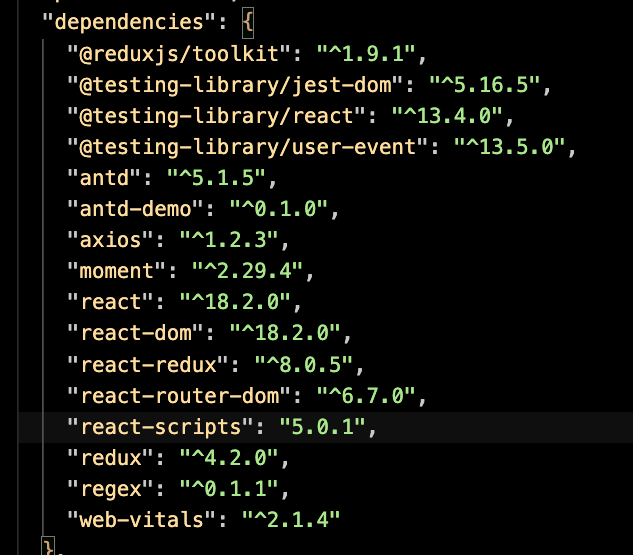

## The App / How To

When you first click on the live link the User is pointed to a login page as shown below : 
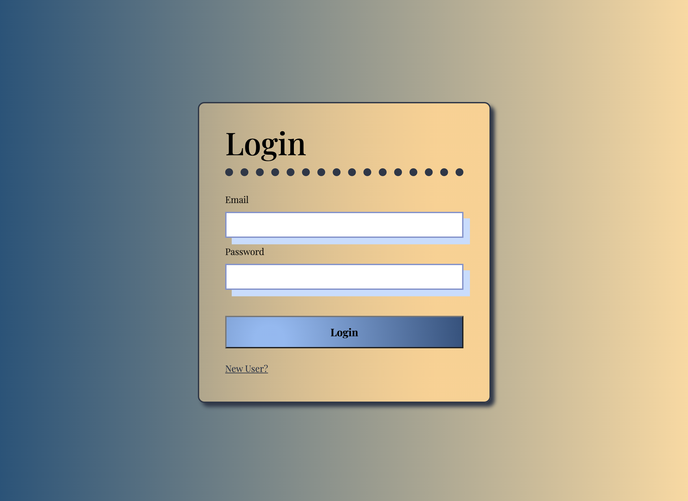 The user if returning can Login or if a New User can click on the New User? option underneath the login button to be directed to the register new user page to create an account. 

Also as shown in the picture if accidentally gone to the create new user page, user can click on the Existing User link underneath the Create User button to navigate back to the login page. 

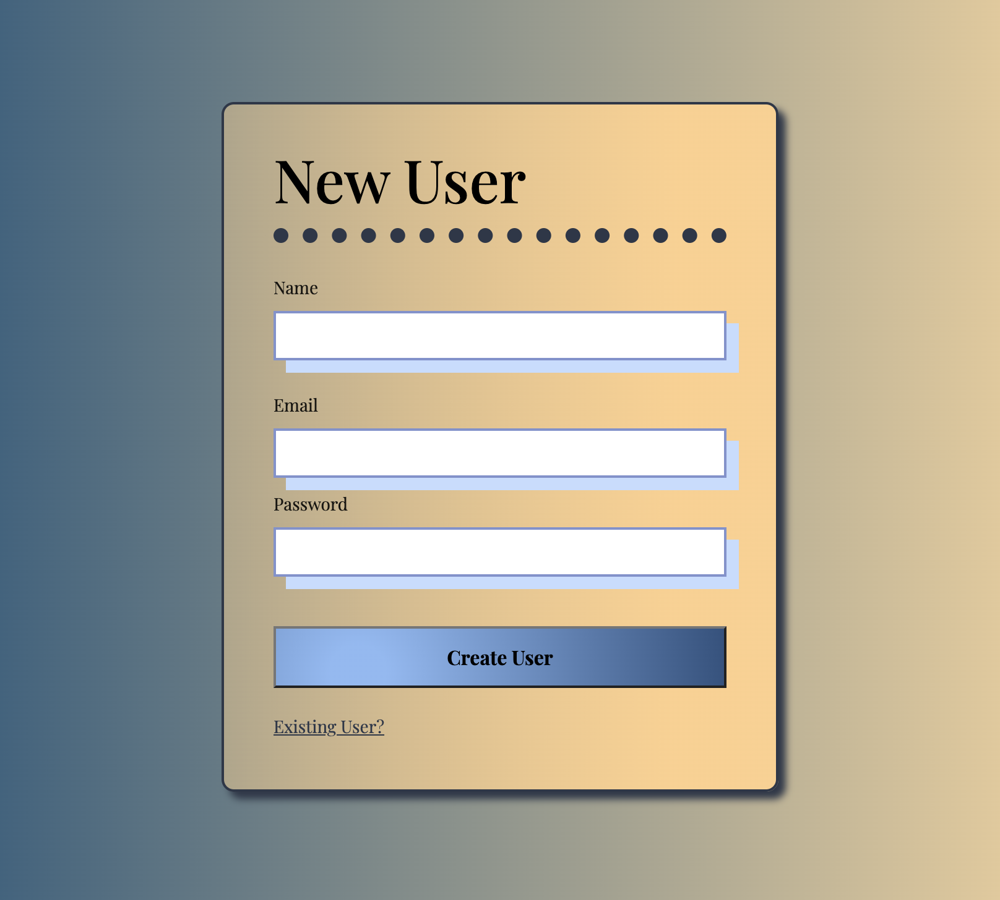
 Once login has been created the user will be redirected to the login page and a message of successfully creating the account will display as also shown below. If an email already exists the user will get an error message stating that the account already exists like shown below.
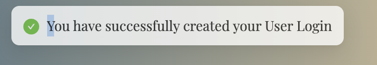
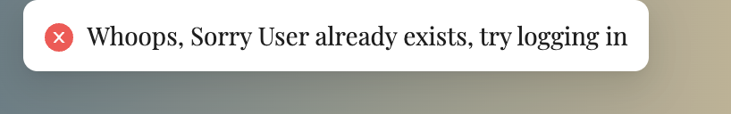

The quiz app accepts two types of users. One is a regular user where as the other is admin. The admin access has been present by me and cannot be changed in the app itself only in the backend database via MongoDb. 

With the pictures displayed below this differentiates between users and is able to let the user know whether they have admin access or not. This is displayed on the home page on top of the header once the user signs in.

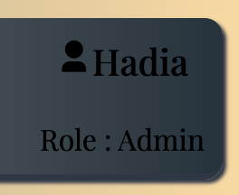
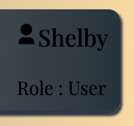

## User
In between pages there is a loader added purposefully 

Once logged in the User will see this as their Home Page: 
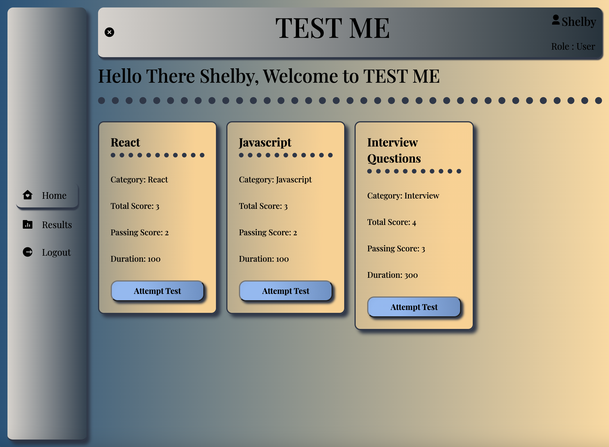 

As you can see the User does not have the Tests tab and they can either stay on the home tab and click on Attempt Test to start a Test or Results to view their own results the user can also click on Logout to logout and navigate to the main login page. 

Under the Results this is what the user will see
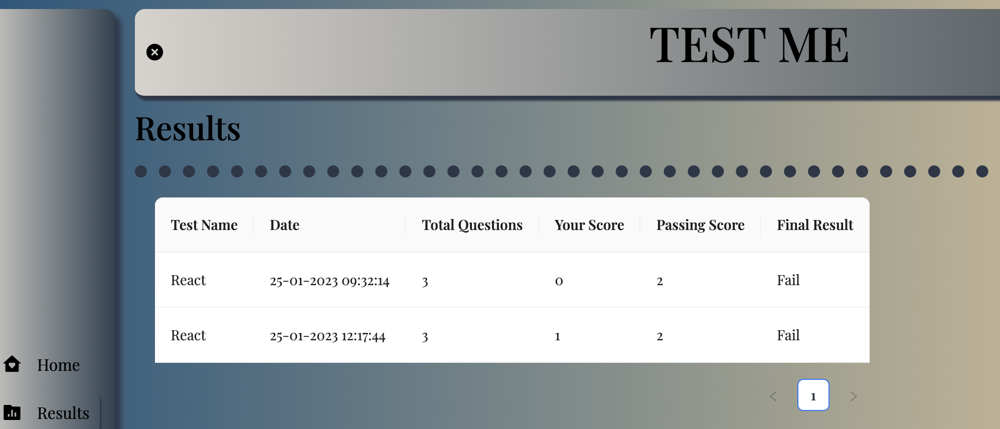

## Admin
Where as the Admin will see :
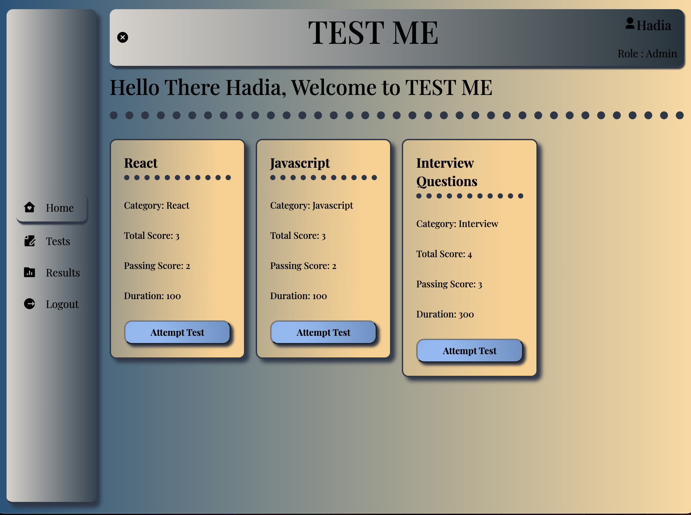

As you can see the admin has the Tests tab which allows the admin to create new Tests, edit existing Test fields like test details and even the test questions. 

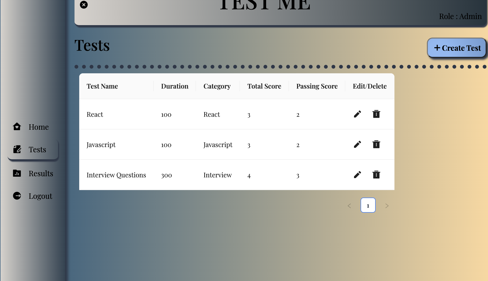

If the Admin chooses to create Test a form pops up with the alotted data that is needed to be accepted in the Test field. IF the user chooses to click on the pencil it will then navigate the admin to the Edit page where there will be two different tabs test-info to edit test details and or Questions? to edit questions. The Delete bin simply deletes the test

The Results tab for the Admin allows the admin to view All user Results and have the ability to search by user or test using the fields up top and the Search button which will search the table for the specific requirements. The clear button will clear out the fields and the specific search pool. 

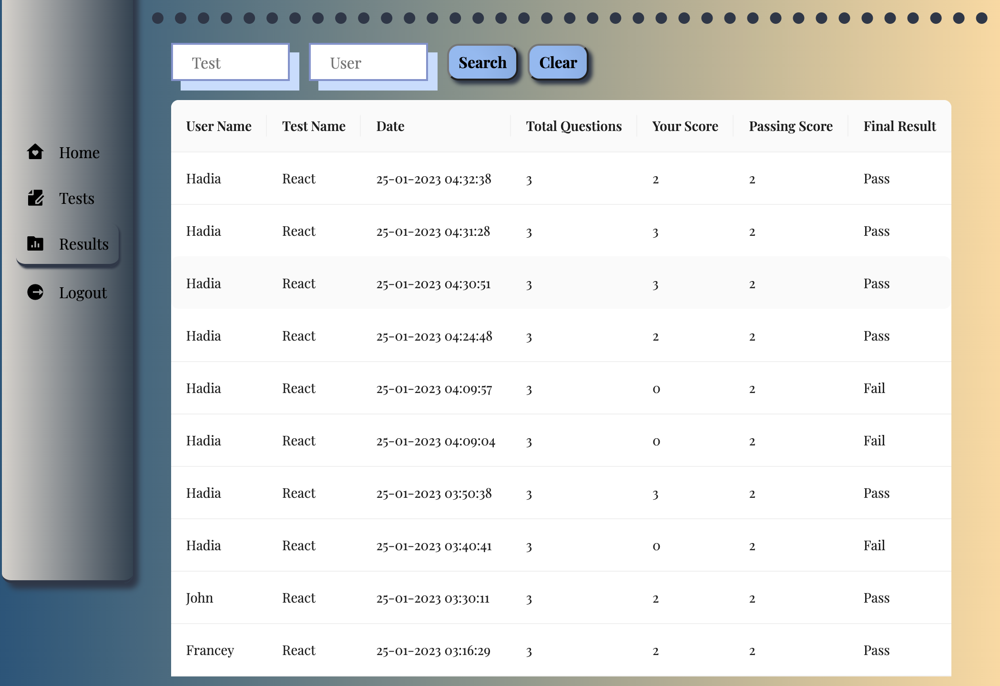

## Both 

Both are able to access Tests that show up on the Home page as shown above. To start the test the User whether admin or not will need to select Test button to be navigated to the test page. 

Before the test comes up there are instructions going over the logic of the test and explaing the ground rules. The user can then clik on the start test to start the test or close to navigate back to home.

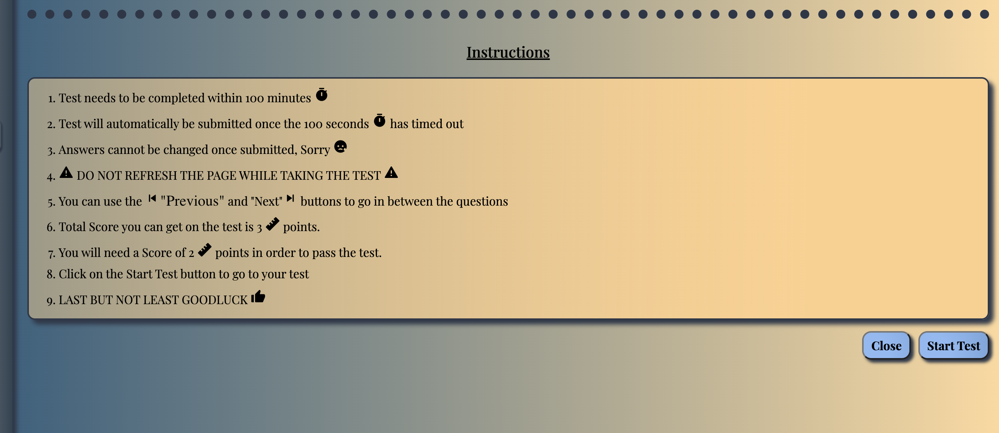

During the Test there is a timer present in the top right hand corner and as the user hovers over the answer button the color will change. If the timer ends the quiz will stop and if the passing score has not been met user will automatically fail. There is also next an previous buttons on the botom left and right hand corner that allow the user to navigate between questions. 
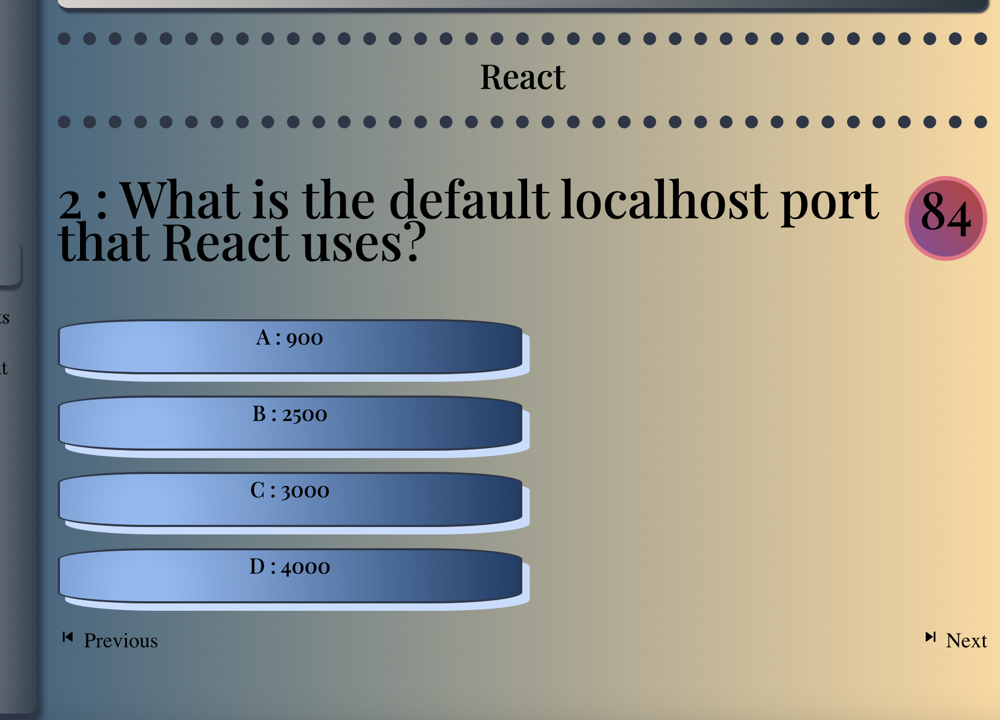

The answer once selected is highlighted a different color to let the user know that that is the answer they have chosen. Once the last question is reached the Submit button will pop up which you can then click to submit the test.

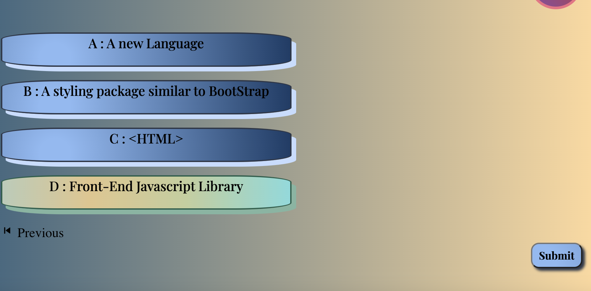

After submitting the test the user will be directed to the result page of that test displaying the stats and final result whether "PASS" or "FAIL" with specific animations. The user can either choose to retry which will navigate user to the test again or review answers which will take the user to the review section.

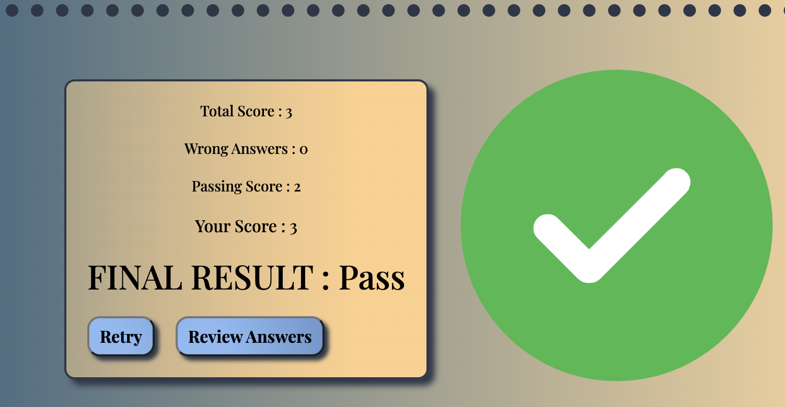

If the user navigates to the review page their question tile will be highlight a different color depending on what they got right or wrong. 

The user also has buttons to navigate to retry which will take them to instructions page or home which will redirect to the home page.
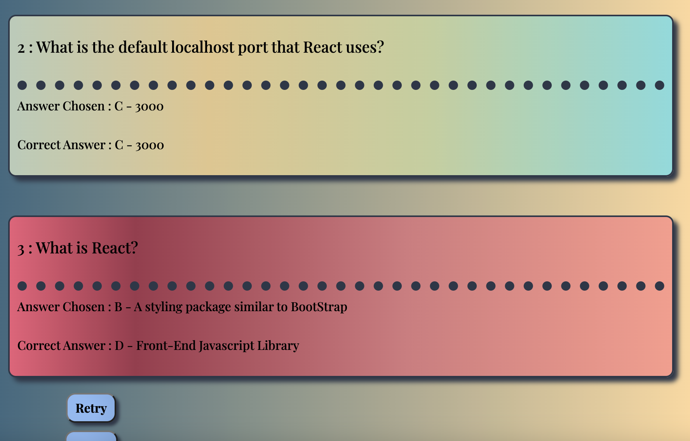

## Technologies Used 

- HTML
- JavaScript
- Ant Design Library
- API's
- MERN Stack Fullstack
- React
- Express
- Node
- MongoDb
- Mongoose
- Axios
- $Regex
- CSS
- Redux 
- Github
- JWT 
- BCrypt

## Future Hopes & Endeavors

My goal is to style it a little differently and potentailly add a tab that has profile which will allow users to edit their profiles and other data pertaining to user specific details. I also would like to give access to all users to be able to create their tests so its user friendly and inclusive to other test topics.

## Resources

- [w3Schools](https://www.w3schools.com/css/css3_shadows_box.asp)

- [Ant-Design](https://ant.design/docs/react/introduce#use-modularized-antd)

- [Youtube](https://www.youtube.com/watch?v=hcGEyh_nBCU)

- [Github](https://github.com/jaspreet145/QuizApp)

- [Udemy](https://www.udemy.com/course/mern-stack-online-quiz-portal-application/)

- [CSS-Gradient](https://cssgradient.io/gradient-backgrounds/)